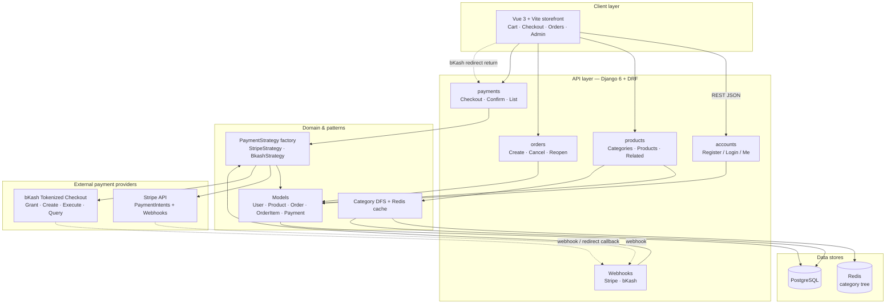
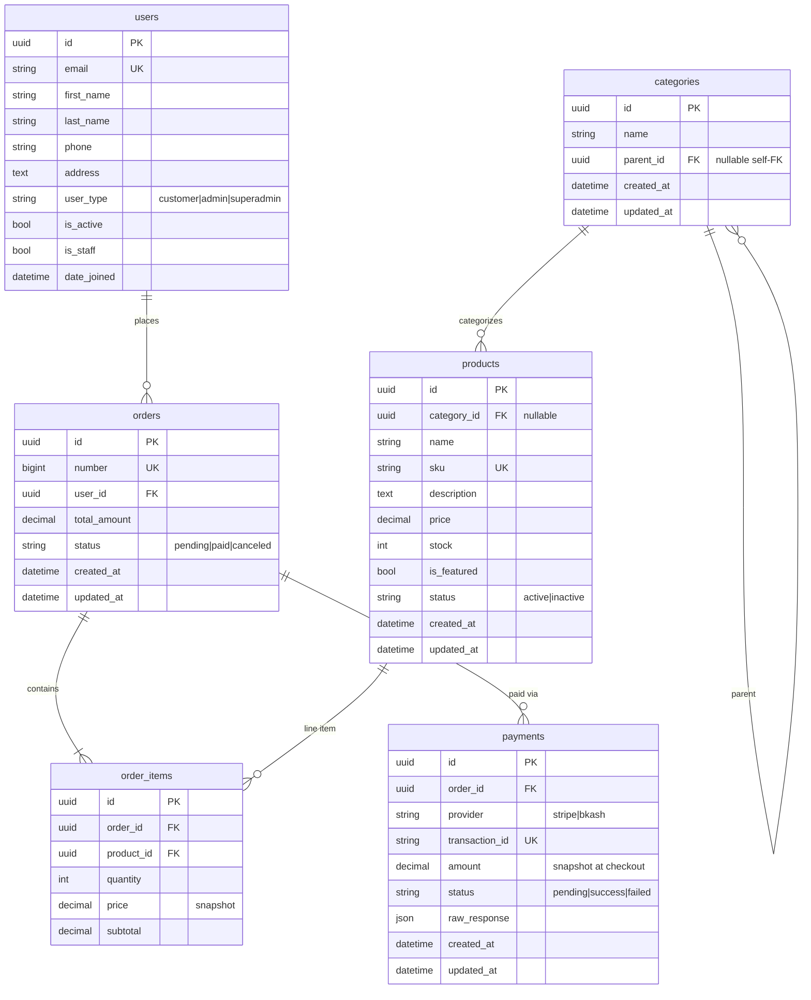
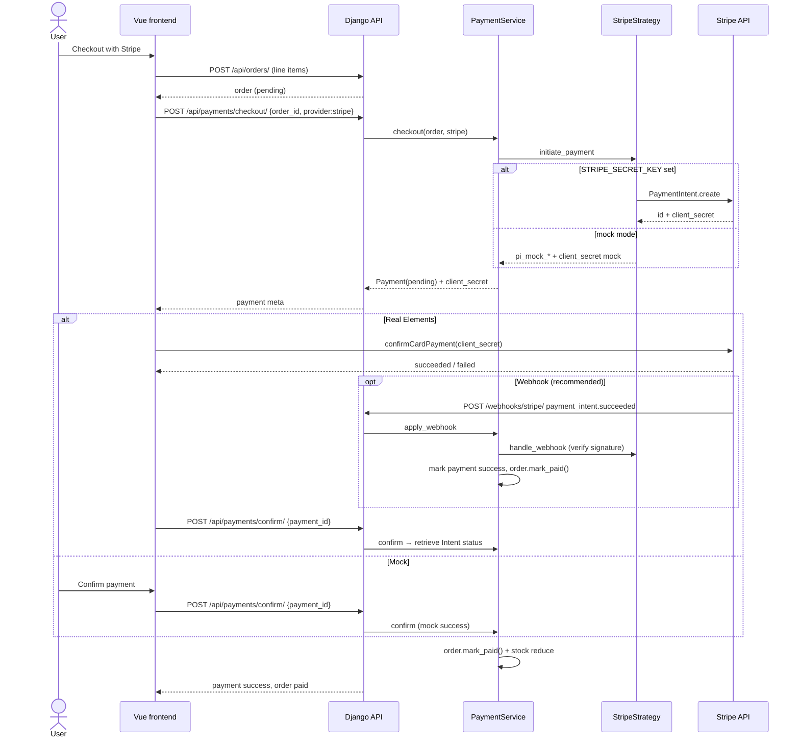
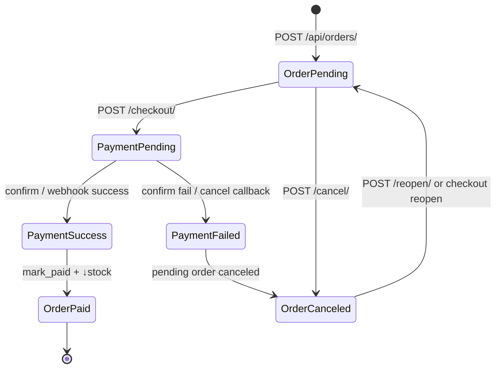

# 4.1 Documentation

EOPS — E-commerce Ordering & Payment System.

| Artifact | Location |
|----------|----------|
| This document (architecture, ERD, payment flows, API reference) | `docs/4.1-documentation.md` |
| Postman collection | `docs/EOPS.postman_collection.json` |
| Swagger UI | http://127.0.0.1:8000/api/docs/ |
| OpenAPI schema | http://127.0.0.1:8000/api/schema/ |
| ReDoc | http://127.0.0.1:8000/api/redoc/ |

Base URL (local): `http://127.0.0.1:8000`  
Auth: DRF Token — header `Authorization: Token <key>` after register/login.

---

## 1. System architecture diagram



### Component notes

| Layer | Responsibility |
|-------|----------------|
| **Vue frontend** | Browse/catalog, cart, checkout (Stripe Elements or bKash redirect), order/payment history, admin CRUD |
| **DRF API** | Token auth, validation, orchestration |
| **Strategy pattern** | Provider-specific initiate / confirm / webhook without changing order core |
| **PostgreSQL** | Source of truth for users, catalog, orders, payments |
| **Redis** | Optional cache for category tree DFS; falls back to DB if unavailable |

---

## 2. Entity Relationship Diagram (ERD)

Core assessment entities plus `Category` (self-referential hierarchy used by products).



### Relationship summary

| From | To | Cardinality | Notes |
|------|-----|-------------|--------|
| User | Order | 1 : N | Cascade delete |
| Order | OrderItem | 1 : N | Cascade delete; subtotal = price × qty |
| Product | OrderItem | 1 : N | `PROTECT` on delete |
| Order | Payment | 1 : N | Multiple attempts allowed (retry / pay-again) |
| Category | Category | 1 : N | Self-FK tree |
| Category | Product | 1 : N | `SET NULL` if category removed |

On successful payment, `Order.mark_paid()` row-locks products (`SELECT FOR UPDATE`) and reduces stock atomically.

---

## 3. API documentation (Postman / Swagger)

### 3.1 Postman

1. Import [`EOPS.postman_collection.json`](./EOPS.postman_collection.json) into Postman.
2. Set collection variables:
   - `base_url` → `http://127.0.0.1:8000`
   - `token` → filled automatically by **Register** / **Login** scripts
3. Run **Auth → Login** (or Register), then Orders / Payments folders.

### 3.2 Swagger / OpenAPI

With the backend running:

| URL | What |
|-----|------|
| http://127.0.0.1:8000/api/docs/ | Swagger UI (interactive) |
| http://127.0.0.1:8000/api/schema/ | Raw OpenAPI 3 schema |
| http://127.0.0.1:8000/api/redoc/ | ReDoc |

1. Call **POST `/api/auth/login/`** (or register) and copy the `token`.
2. Click **Authorize** in Swagger UI.
3. Enter `Token <your-key>` (include the word `Token` and a space).
4. Try checkout / orders endpoints.

Built with [`drf-spectacular`](https://github.com/tfranzel/drf-spectacular).

### 3.3 Endpoint reference

Auth header (authenticated routes): `Authorization: Token {{token}}`

#### Auth — `/api/auth/`

| Method | Path | Auth | Body / notes |
|--------|------|------|----------------|
| `POST` | `/api/auth/register/` | Public | `{ "email", "password", "first_name?", "last_name?", "phone?", "address?" }` → `{ token, user }` |
| `POST` | `/api/auth/login/` | Public | `{ "email", "password" }` → `{ token, user }` |
| `GET` | `/api/auth/me/` | Token | Current user profile |
| `PATCH` | `/api/auth/me/` | Token | Partial update (`first_name`, `last_name`, `phone`, `address`) |

#### Categories — `/api/categories/`

| Method | Path | Auth | Notes |
|--------|------|------|--------|
| `GET` | `/api/categories/` | Public | Flat list |
| `GET` | `/api/categories/tree/` | Public | Nested tree (Redis-cached DFS) |
| `GET` | `/api/categories/{id}/` | Public | Retrieve |
| `POST` | `/api/categories/` | Admin | Create `{ name, parent? }` |
| `PUT`/`PATCH` | `/api/categories/{id}/` | Admin | Update |
| `DELETE` | `/api/categories/{id}/` | Admin | Delete (invalidates tree cache) |

#### Products — `/api/products/`

| Method | Path | Auth | Notes |
|--------|------|------|--------|
| `GET` | `/api/products/` | Public | Active only for customers; query `?category=` + `include_descendants=` |
| `GET` | `/api/products/{id}/` | Public | Detail |
| `GET` | `/api/products/{id}/related/` | Public | Related via category DFS |
| `POST` | `/api/products/` | Admin | Create |
| `PUT`/`PATCH` | `/api/products/{id}/` | Admin | Update |
| `DELETE` | `/api/products/{id}/` | Admin | Delete |

#### Orders — `/api/orders/`

| Method | Path | Auth | Notes |
|--------|------|------|--------|
| `GET` | `/api/orders/` | Token | Own orders (all for admin) |
| `POST` | `/api/orders/` | Token | `{ "items": [{ "product_id", "quantity" }] }` |
| `GET` | `/api/orders/{id}/` | Token | Detail + items + payments |
| `POST` | `/api/orders/{id}/cancel/` | Token | Pending → canceled |
| `POST` | `/api/orders/{id}/reopen/` | Token | Canceled → pending (stock check) |

#### Payments — `/api/payments/`

| Method | Path | Auth | Notes |
|--------|------|------|--------|
| `GET` | `/api/payments/` | Token | List |
| `GET` | `/api/payments/{id}/` | Token | Detail |
| `POST` | `/api/payments/checkout/` | Token | `{ "order_id", "provider": "stripe"\|"bkash" }` → payment + `client_secret` / `redirect_url` / `mock` |
| `POST` | `/api/payments/confirm/` | Token | `{ "payment_id" }` or `{ "transaction_id", "callback_status?" }` |
| `POST` | `/api/payments/webhooks/stripe/` | Public | Stripe-Signature verified when secret set |
| `POST` | `/api/payments/webhooks/bkash/` | Public | Takes `paymentID` only; status re-queried from bKash |

---

## 4. Payment flow diagrams

### 4.1 Stripe (PaymentIntents + Elements)



**Stripe webhook events handled:** `payment_intent.succeeded` → success; `payment_intent.payment_failed` / `payment_intent.canceled` → failed.

---

### 4.2 bKash (Tokenized Checkout)

```mermaid
sequenceDiagram
  actor User
  participant FE as Vue frontend
  participant API as Django API
  participant SVC as PaymentService
  participant BK as BkashStrategy
  participant bKash as bKash API

  User->>FE: Checkout with bKash
  FE->>API: POST /api/orders/
  API-->>FE: order (pending)
  FE->>API: POST /api/payments/checkout/ {order_id, provider:bkash}
  API->>SVC: checkout(order, bkash)
  SVC->>BK: initiate_payment
  alt Credentials configured
    BK->>bKash: token/grant
    bKash-->>BK: id_token
    BK->>bKash: checkout/create (amount, callbackURL)
    bKash-->>BK: paymentID + bkashURL
  else mock mode
    BK-->>SVC: bkash_mock_* (no redirect)
  end
  SVC-->>API: Payment(pending) + redirect_url
  API-->>FE: payment meta

  alt Real sandbox / production
    FE->>User: Redirect to bkashURL
    User->>bKash: Wallet · OTP · PIN
    bKash->>FE: Redirect callback ?paymentID=&status=
    FE->>API: POST /api/payments/confirm/ {transaction_id, callback_status}
    alt callback cancel/failure
      API->>SVC: mark failed, order canceled
    else success / pending
      API->>SVC: confirm
      SVC->>BK: confirm_payment
      BK->>bKash: execute (or query status)
      bKash-->>BK: transactionStatus
    end
    opt Server webhook
      bKash->>API: POST /webhooks/bkash/ {paymentID}
      Note over API,BK: Status never trusted from payload;<br/>always Query Payment API
      API->>SVC: apply_webhook → query/execute
    end
  else Mock
    FE->>API: POST /api/payments/confirm/ {payment_id}
    API->>SVC: mock success
  end

  SVC->>SVC: on success → order.mark_paid() + stock reduce
  API-->>FE: payment / order status
```

**Security note:** bKash webhooks only read `paymentID` from the body. Final status always comes from bKash Query (and optionally Execute). Optional `BKASH_WEBHOOK_SECRET` + `X-Bkash-Signature` HMAC gates the endpoint.

---

## 5. High-level checkout lifecycle


